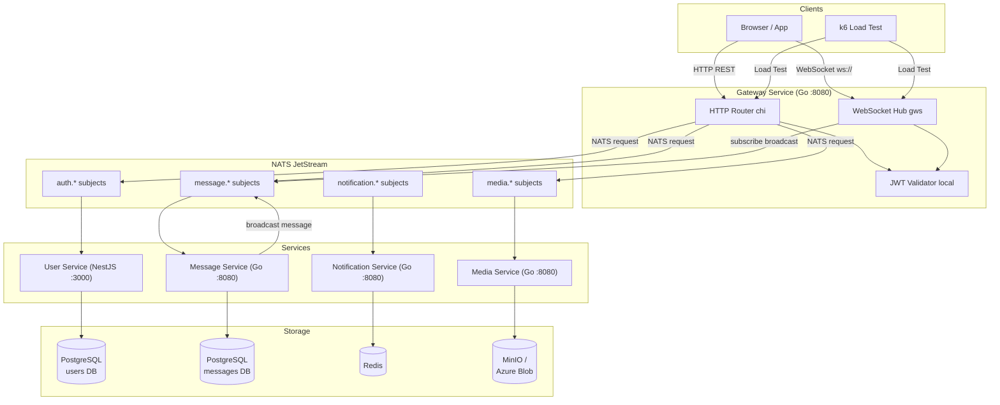
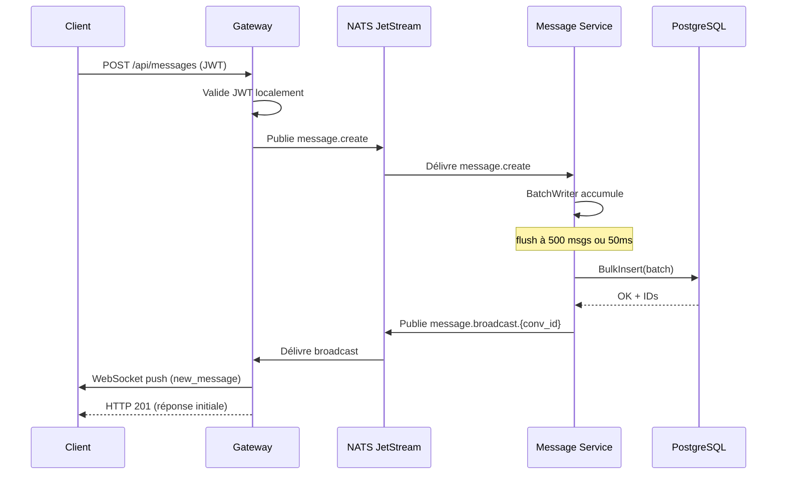
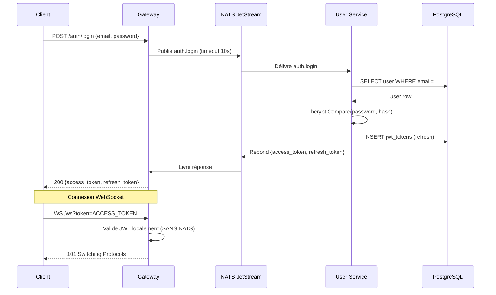
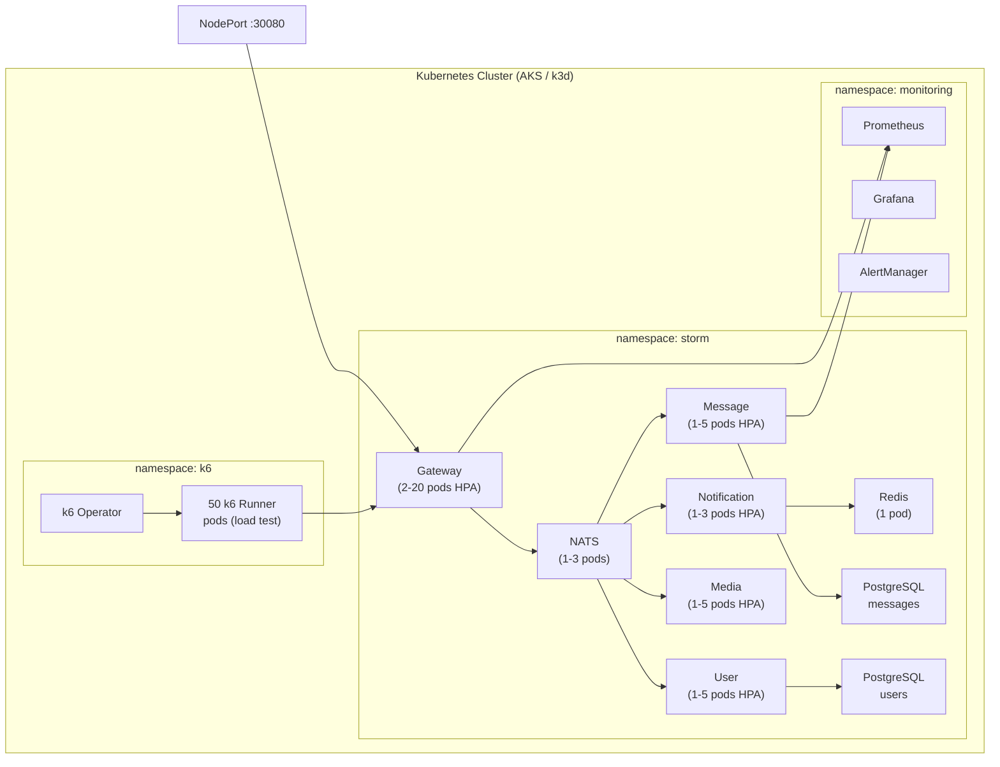

# Architecture STORM

## Vue d'ensemble

## Flux d'un message WebSocket

## Flux d'authentification

## Infrastructure K8s

## Dimensionnement pour le Storm Day

| Composant | Répliques | CPU | RAM | Justification |
|-----------|-----------|-----|-----|---------------|
| Gateway | 10 (HPA max 20) | 2 | 2Gi | 100k conn × ~100KB = 10GB total |
| Message | 10 | 1 | 512Mi | BatchWriter absorbe 50k msg/s par pod |
| User | 1-5 | 250m | 256Mi | Auth peu sollicité pendant le test |
| NATS | 1 (3 en prod) | 4 | 6Gi | 500k msg/s × ~1KB = 500MB/s |
| PostgreSQL | 1 | 4 | 6Gi | 1k bulk inserts/s, tuning aggressif |
| Redis | 1 | 1 | 2Gi | 100k sessions |
| k6 runner | 50 | 2 | 4Gi | 2k VUs × 1.5MB = 3GB/pod |
